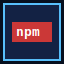

 

---

## Tech Stack

---

## Contact

Slide right in if you want to collaborate on a project!

---
## Activity Monitor

<picture>
  <source 
    media="(prefers-color-scheme: dark)" 
    srcset="./assets/puzzle-bobble-dark.svg"
  />
  <source 
    media="(prefers-color-scheme: light)" 
    srcset="./assets/puzzle-bobble.svg"
  />
  
</picture>

---

## Featured Work

| Project                       | Focus                                                      | Stack             |
| ----------------------------- | ---------------------------------------------------------- | ----------------- |
| **Ely Sales Agent**           | Real-time AI sales assistant for live client conversations | TypeScript, React |
| **ECHO**                      | Clean personal finance tracking experience                 | TypeScript        |
| **Interactive Web Portfolio** | Smooth and familiar portfolio experience                   | React, Vercel     |

---
